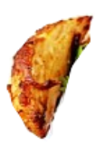
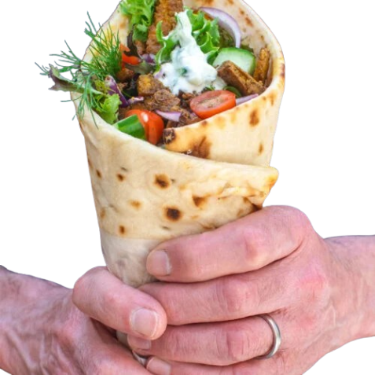

#Boba or Bomb Game 

A iethree-page game built with React, TypeScript, and Vite. atc fd item whilavoiding bombs! Choose foo

FdDrp## Stup

1. Install dependencies:
```bash
npm install
```

. Start the development server:
```bash
npm run dev
```

. Open your browser and navigate to the local server (usually http://localhost:3)

##  How to Play

1. **Start Screen**: Choose your favorite food or drink item
2. **Game Screen**:
   - Use arrow keys (←/→) or A/D keys to move your cup
   - Touch anddrag on mobile devices
   - Catch food items (good!) and avoid bombs (bad!)
   - Fill your cup with 10 items to win
3. **Result Screen**: See if you won or lost, then play again!

## 🍴 Available Food Items

### Drinks & Beverages:
- 🧋 **Boba** - Classic tapioca pearls
  
- 🥛 **Milk Tea** - Creamy milk tea
  
- 🍵 **Matcha** - Japanese green tea
  
- 🥤 **Milkshake** - Thick and creamy milkshake
  
- 🍹 **Taro** - Purple taro drink
  

### Food Items:
- 🍗 **Chicken** - Grilled chicken pieces
  
- 🥙 **Shawarma** - Middle Eastern wrap
  
- 🧊 **Ice** - Cooling ice cubes
  
- 💻 **Laptop** - Tech energy boost
  
- 🔋 **Battery** - Power up your game
  
- ❤️ **Pixel Heart** - Extra lives
  

### Special Items:
- 💣 **Bomb** - Avoid these at all costs!
  
- Numbers 1-10 for scoring and levels
  

## 🎨 Assets Location

All game assets are stored in the `./assets/` directory with relative paths:

```
assets/
├── boba.png          # Boba pearls
├── milk_tea.png      # Milk tea drink
├── matcha.png        # Matcha green tea
├── milkshake.png     # Milkshake
├── taro.png          # Taro drink
├── chicken.png       # Chicken pieces
├── shawarma.png      # Shawarma wrap
├── ice.png           # Ice cubes
├── laptop.png        # Laptop item
├── battery.png       # Battery power-up
├── pixelheart.png    # Heart extra life
├── bomb.png          # Bomb (avoid!)
├── 1.png - 10.png    # Number items
├── Group 1.png - Group 10.png  # Grouped items
└── .DS_Store         # macOS system file (ignored)
```

##  Game Features

-Responsive esign orks  on mobile anddesktop
- Canvas-based endering mooth animations
- Touch and keyboard controls
- Visual cup fillas you collect food
-  Automatic window resize handling
- HighDPI  diplaysFood11dffrentfood drink suppor

##  Technicalta

- t React 18 TypeScript d Vite
- es HTML5 Canvas or game reendring
 ReuestAniFodItmmationfoditmame for smootratio support I

4. **mages not loading**: Check that all paths in `./assets/` are correctfor crisp grahics
- ied delt time for consistent phsics across deices
